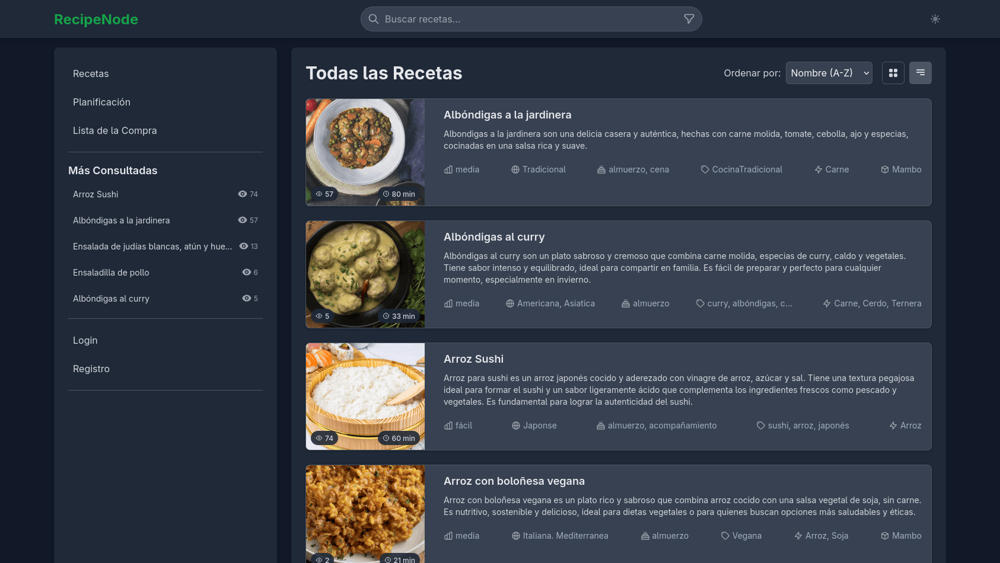
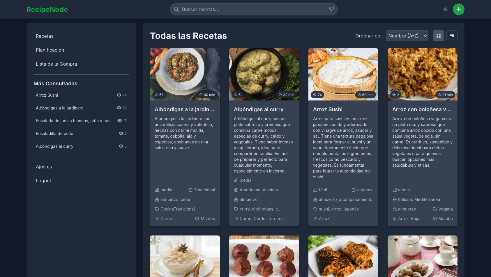
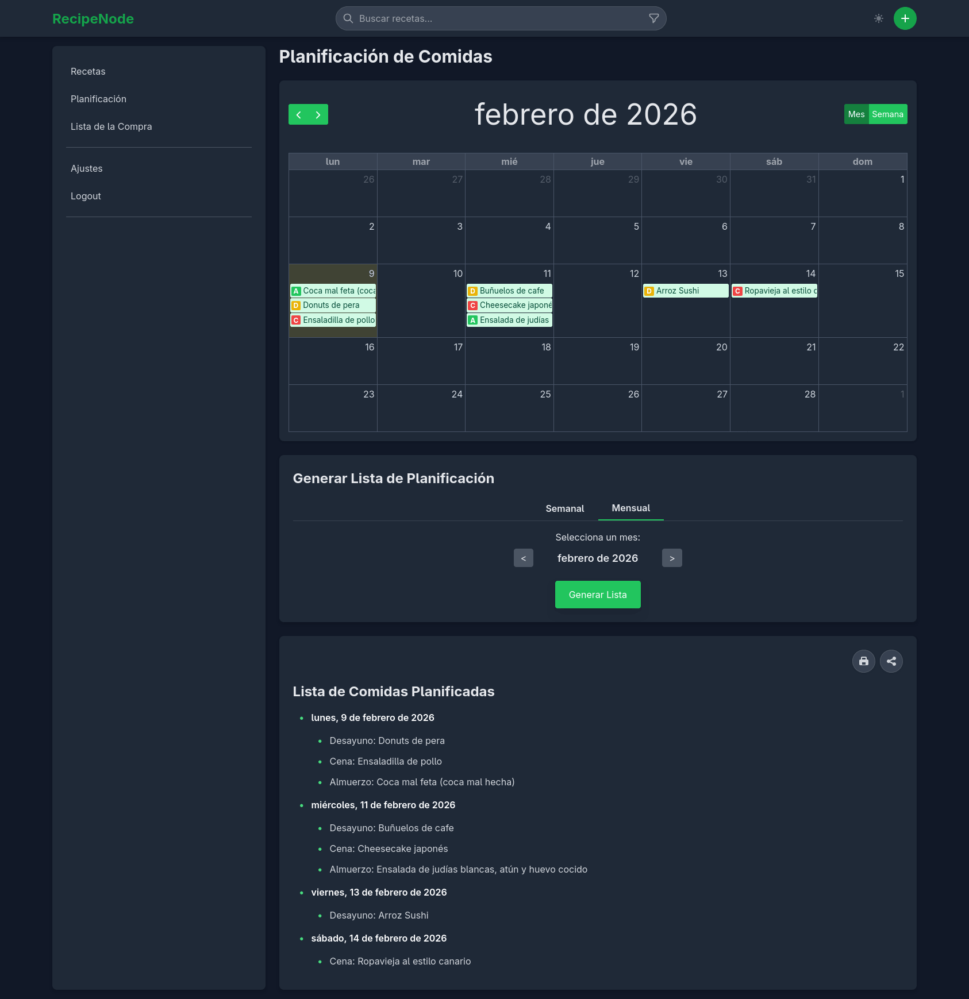
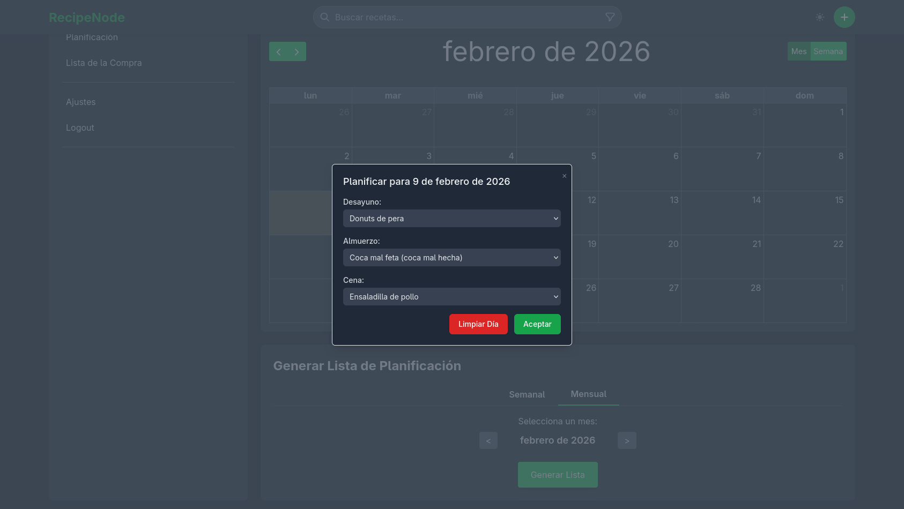
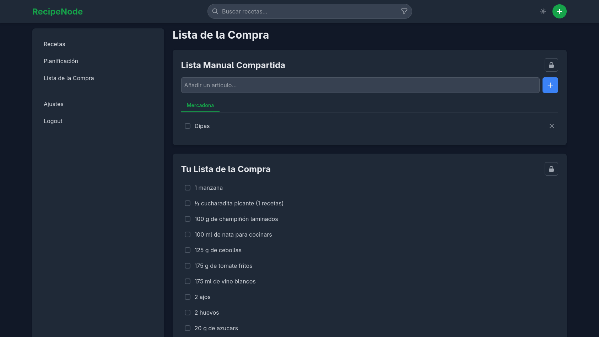
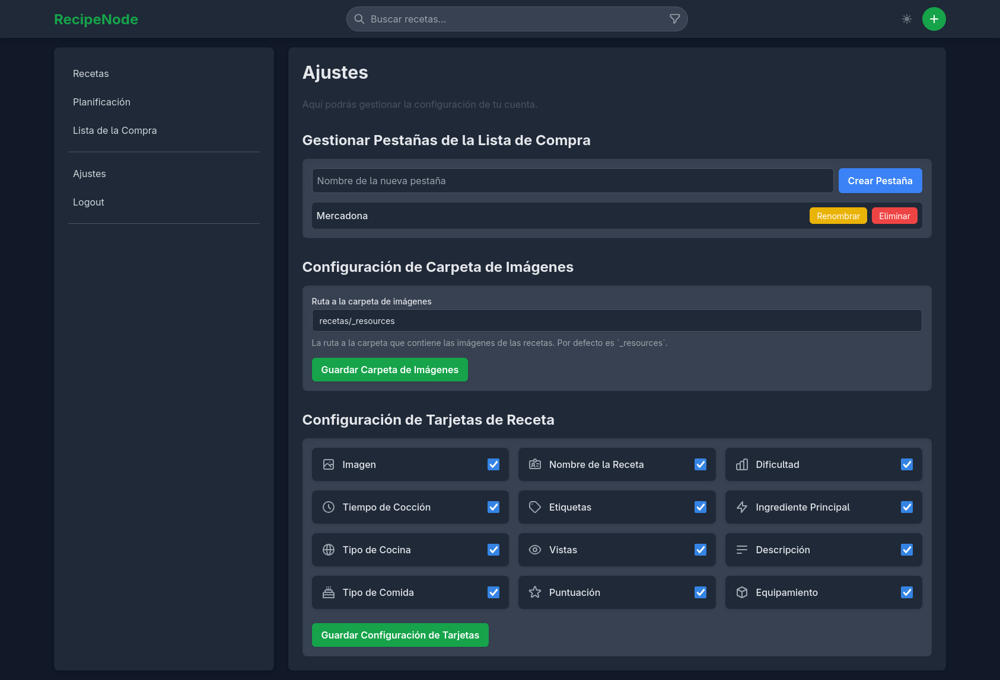

# RecipeNode: Tu Gestor de Recetas Personal

> Una aplicación web moderna y auto-alojada, construida con Node.js, Express y SQLite para gestionar y compartir tus recetas de cocina favoritas.

RecipeNode transforma una simple carpeta de archivos Markdown en un potente gestor de recetas con una interfaz web limpia, un planificador de comidas semanal y una lista de la compra inteligente. Es la solución perfecta para quienes aman organizar sus recetas digitalmente, especialmente para usuarios de editores como Obsidian.

## ✨ Características

- **Gestión Basada en Archivos:** Las recetas son archivos Markdown (`.md`) fáciles de editar, respaldar y versionar con Git.
- **Sintaxis de Obsidian:** Soporte nativo para la sintaxis de `![[imagen.jpg]]` y `[[Otra Receta]]`, ideal para usuarios del popular editor de notas.
- **Planificador de Comidas:** Organiza tus desayunos, almuerzos y cenas en un calendario semanal interactivo.
- **Lista de la Compra Inteligente:** Genera automáticamente una lista de la compra a partir de tu planificación semanal y permite añadir artículos manualmente.
- **Autenticación y Roles:** Sistema de usuarios con sesiones seguras y un rol de administrador para proteger acciones críticas.
- **Búsqueda y Filtrado Avanzado:** Encuentra recetas rápidamente por nombre, ingredientes, etiquetas, tipo de cocina, dificultad y más.
- **Actualizaciones en Tiempo Real:** La lista de la compra y otras partes de la UI se actualizan instantáneamente para todos los usuarios conectados gracias a WebSockets (`Socket.io`).
- **Interfaz Limpia y Adaptable:** Diseño responsive que funciona de maravilla en ordenadores, tabletas y móviles.
- **Configuración Flexible:** Personaliza la ubicación de tus recursos, como la carpeta de imágenes, directamente desde la configuración de la aplicación.

## 📸 Capturas de Pantalla

### Vista Principal


### Vista de Cuadrícula


### Planificador de Comidas




### Lista de la Compra


### Ajustes


## 🏗️ Arquitectura del Proyecto

- **Backend:** `Node.js` y `Express.js` forman el núcleo de la aplicación, manejando el enrutamiento, la lógica de negocio y la API REST.
- **Base de Datos:** Se utiliza `SQLite` para una gestión de datos ligera y sin configuración. Hay dos bases de datos principales:
  - `database.db`: Almacena metadatos de recetas, planificaciones, usuarios y la lista de la compra.
  - `sessions.db`: Gestiona las sesiones de usuario de forma persistente.
- **Frontend (Server-Side Rendering):** Las vistas se renderizan en el servidor con `EJS`, un motor de plantillas simple y potente. Esto asegura una carga inicial rápida y una buena indexación por motores de búsqueda (SEO).
- **Gestión de Recetas:** Un sistema de vigilancia (`chokidar`) monitoriza la carpeta `recetas/`. Al añadir, modificar o eliminar un archivo `.md`, la aplicación utiliza `front-matter` y `marked` para parsear los metadatos y el contenido, actualizando la base de datos en consecuencia.
- **Tiempo Real:** `Socket.io` permite la comunicación bidireccional entre el cliente y el servidor, usado para sincronizar la lista de la compra y notificar a los usuarios de cambios en tiempo real.

## 📱 Experiencia Móvil

Esto te permite:

- Consultar tus recetas cómodamente desde la cocina en una tablet o móvil.
- Añadir ingredientes a tu lista de la compra mientras estás en el supermercado.
- Planificar las comidas de la semana desde cualquier lugar.

## 🚀 Instalación y Uso

Estas instrucciones te permitirán obtener una copia del proyecto en funcionamiento en tu máquina local para propósitos de desarrollo y pruebas.

### 📋 Prerrequisitos

- [Node.js](https://nodejs.org/) (v18.x o superior recomendado)
- [npm](https://www.npmjs.com/) (normalmente viene con Node.js)

### 🔧 Instalación

Sigue estos pasos para tener un entorno de desarrollo listo:

1. Clona el repositorio:
   ```sh
   git clone https://github.com/tu-usuario/RecipeNode.git
   ```
2. Navega al directorio del proyecto:
   ```sh
   cd RecipeNode
   ```
3. Crea un archivo de entorno. Copia `.env.example` a un nuevo archivo llamado `.env`:
   ```sh
   cp .env.example .env
   ```
4. Edita el archivo `.env` y personaliza las variables, especialmente `SESSION_SECRET` con un valor largo y aleatorio:
   ```
   ADMIN_PASSWORD=tu_contraseña_segura
   SESSION_SECRET=un-secreto-muy-largo-y-aleatorio-para-las-sesiones
   ```
5. Instala las dependencias:
   ```sh
   npm install
   ```

## 🏃 Uso

Para iniciar la aplicación en modo de desarrollo (con recarga automática):

```sh
npm run dev
```

Para ejecutar la aplicación en producción:

```sh
npm start
```

## 📝 Estructura de Recetas Markdown

Las recetas se almacenan como archivos Markdown (`.md`) en el directorio `recetas/`. Cada archivo debe comenzar con un bloque de "front-matter" YAML, seguido del contenido de la receta en Markdown.

### Front-Matter (YAML)

El bloque de front-matter contiene metadatos clave sobre la receta. Debe estar delimitado por `---` al principio y al final.

Ejemplo:

```yaml
---
title: "Mi Receta Deliciosa"
image: "/resources/mi-receta-deliciosa.jpg" # Opcional: ruta a la imagen principal
servings: 4 # Opcional: número de porciones
time: 60 # Opcional: tiempo de cocción en minutos
cuisine: "Mediterránea" # Opcional: tipo de cocina
source: "https://ejemplo.com/receta-original" # Opcional: URL de la receta original
created: 2023-10-26T10:00:00Z # Opcional: fecha de creación (ISO 8601)
updated: 2023-10-26T10:00:00Z # Opcional: fecha de última actualización (ISO 8601)
---
```

**Campos requeridos y opcionales:**

- `title` (string, **requerido**): El nombre de la receta.
- `image` (string, opcional): La ruta a la imagen principal de la receta. Puede ser una URL relativa (`/resources/imagen.jpg`) o absoluta.
- `servings` (número, opcional): El número de porciones que rinde la receta. Utilizado para escalar ingredientes.
- `time` (número, opcional): El tiempo total de cocción en minutos. Utilizado para filtrar.
- `cuisine` (string, opcional): El tipo de cocina (ej. "Italiana", "Mexicana"). Utilizado para filtrar.
- `source` (string, opcional): La URL de la receta original si fue importada o adaptada.
- `created` (string, opcional): Fecha y hora de creación de la receta en formato ISO 8601.
- `updated` (string, opcional): Fecha y hora de la última actualización de la receta en formato ISO 8601.

### Contenido Markdown

Después del front-matter, el resto del archivo es el contenido de la receta en formato Markdown. Se recomienda estructurar el contenido con encabezados para secciones como "Ingredientes", "Instrucciones", "Notas", etc.

**Sintaxis especial:**

- **Imágenes de Obsidian:** `![[nombre-de-imagen.jpg]]` se convierte automáticamente en una etiqueta ``.
- **Enlaces a otras recetas:** `[[Nombre de Otra Receta]]` se convierte en un enlace a esa receta dentro de la aplicación.
- **Listas de tareas:** Las listas de tareas Markdown (`- [ ] Tarea`) se renderizan como casillas de verificación interactivas.
- **Temporizadores:** Patrones como "10 minutos" o "30 segundos" se pueden convertir en temporizadores interactivos.

```markdown
# Mi Receta Deliciosa

## Ingredientes

- 2 pechugas de pollo
- 1 cebolla
- 10 minutos de cocción

## Instrucciones

1.  Paso uno.
2.  Paso dos.
```

## 🧪 Ejecutando las Pruebas

Para ejecutar el conjunto de pruebas automatizadas:

```sh
npm test
```

## 🤝 Contribuyendo

Las contribuciones son lo que hacen que la comunidad de código abierto sea un lugar increíble para aprender, inspirar y crear. Cualquier contribución que hagas será **muy apreciada**.

Por favor, lee `CONTRIBUTING.md` (si existe) para más detalles sobre nuestro código de conducta y el proceso para enviarnos pull requests.

## 📄 Licencia

Este proyecto está bajo la Licencia (Tu Licencia) - mira el archivo `LICENSE.md` para más detalles.
